适用于Windows

# 教程

## 配置

首先下载bat文件到你本地，使用记事本打开

两个参数需要修改

```bat
set "USERNAME=校园网账号"
set "PASSWORD=校园网密码"
```

修改完毕后保存并关闭记事本。

## 启动

打开[校园网管理平台](http://172.16.254.19:8080/Self)，注销你当前电脑的联网

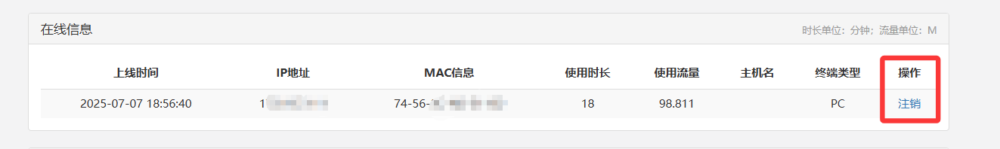

注销后随意打开一个网页，比如[B站](https://space.bilibili.com/384412111)，检查一下是否断网成功

接着就可以双击配置好的bat文件，正常情况下会出现以下界面，这是连接成功的状态。

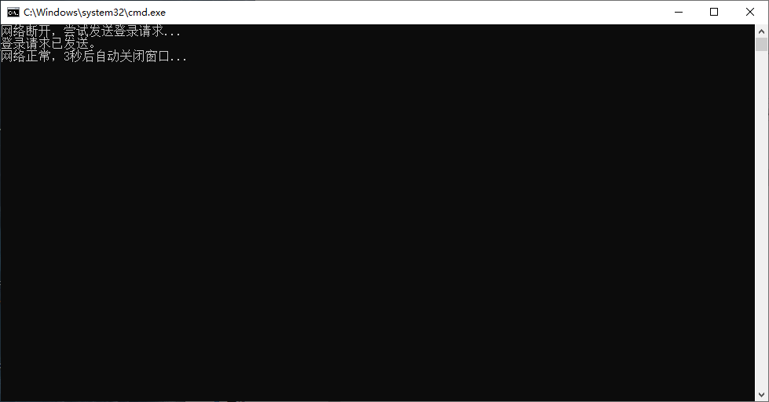

如果出现重复尝试登录，检查一下是不是账号密码没设置正确


## 自动启动

借助Windows的"任务计划程序"来每天定时启动这个脚本，实现断网重连。

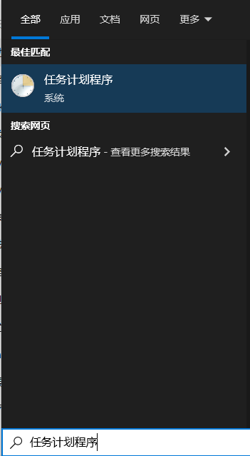


按照图片一步一步的执行就行

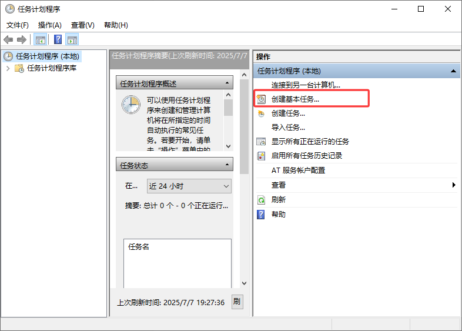


随意起名

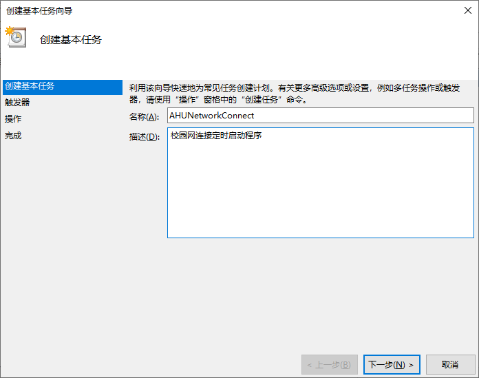


设置每天执行

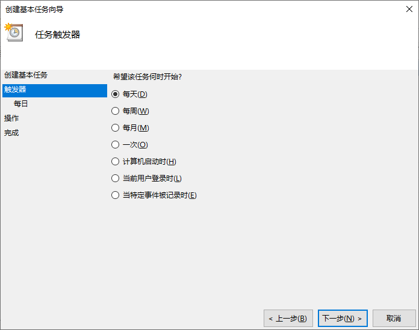


然后再随便设置个时间，后面还可以修改。

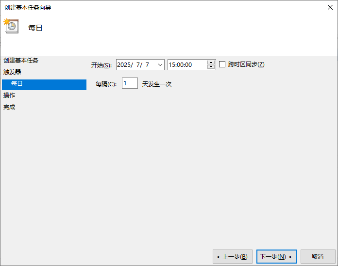

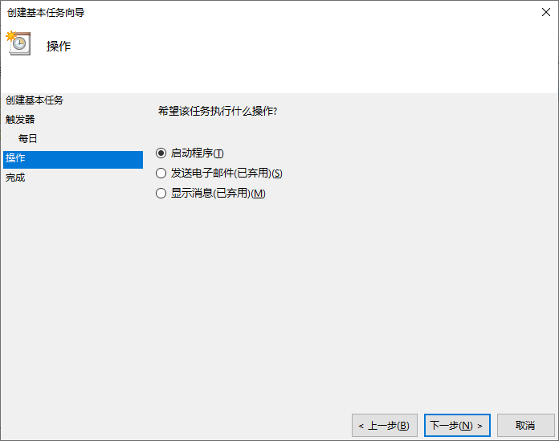


找到脚本的路径，输入进去

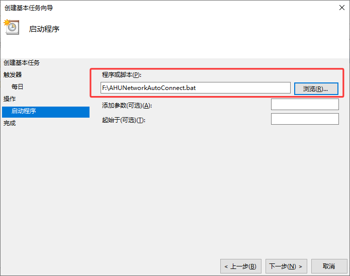


然后在主界面就可以看到创建好的定时任务了，右键该任务，点击“启动”，可以测试是否设置成功。

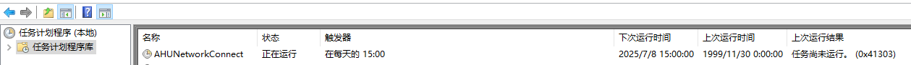


每天才执行一次检查是否断网，肯定是不够的，所以双击该任务，点击到触发器那一栏，多设置几个定时启动即可。

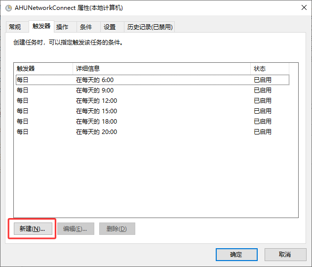

## 开机自启

当然也可以设置开机自启，新增个触发器就可以了。

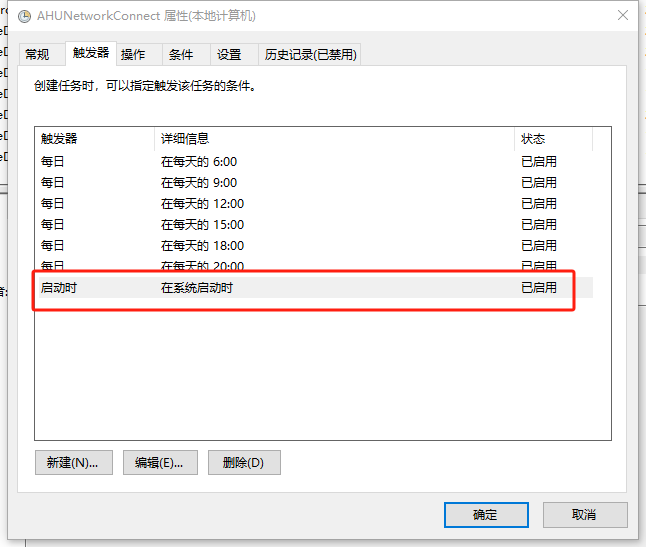

# 觉得有用麻烦给我个Star⭐