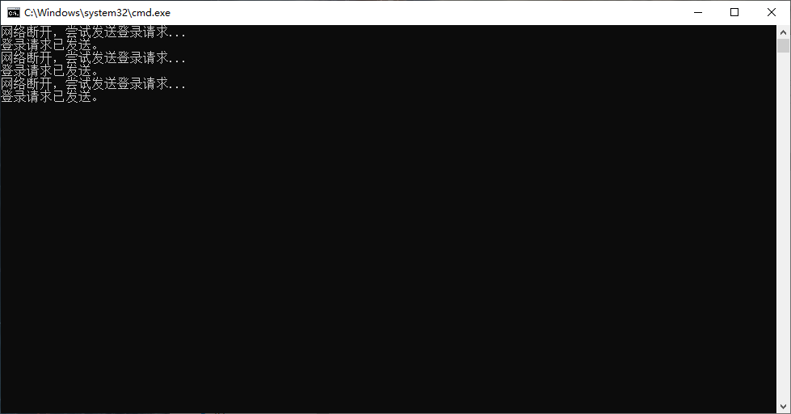

Windows系统校园网断网重连，研究牲必备

觉得有用麻烦给我个Star⭐


# 教程

## 配置

首先下载bat文件到你本地，使用记事本打开

下面三个参数需要修改

```bat
set "USERNAME=校园网账号"
set "PASSWORD=校园网密码"
set "USERIP=xxx.xxx.xxx.xxx"
```

其中USERNAME和PASSWORD就是校园网账号和密码

USERIP需要**连接校园网**后查看，Win + R打开CMD，输入`ipconfig`。查看自己的IP，填在USERIP后面


保存并关闭记事本。

## 检测

打开[校园网管理平台](http://172.16.254.19:8080/Self)，注销你当前电脑的联网


注销后随意打开一个网页，比如[B站](https://space.bilibili.com/384412111)，检查一下是否断网了

然后双击启动配置好的bat文件，会出现以下界面，这是登陆成功的状态。


如果出现重复尝试登录，检查一下是不是账号密码没设置正确，或者**IP地址**不正确。



## 自动执行

该bat文件双击执行，帮你重连网络成功后，就关闭了，如果再次断网，没办法自动启动帮你连接。

所以需要借助Win的"任务计划程序"


